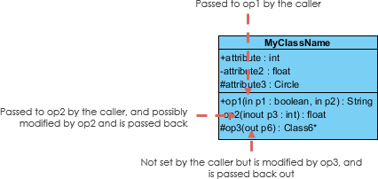
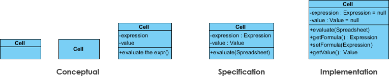
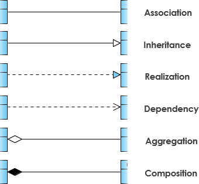
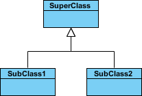

<!-- 
Blues/Greys: steelblue, royalblue, dodgerblue, slategray, darkslateblue.
Greens:      seagreen, forestgreen, olive, darkolivegreen.
Reds/Pinks:  crimson, indianred, firebrick, salmon.
Earth Tones: sienna, peru, chocolate, goldenrod. 
-->

:::{.callout}
It is difficult to create slide presentation for UML class diagram. For this reason, the live lecture will use this HTML file as a presentation mean.
::: 
# UML Class Notation

A class represents a concept which encapsulates **state** (attributes) and **behavior** (operations). Each attribute has a type. Each operation has a **signature**. The class name is the *only mandatory information*.


## Class Structure

A standard UML class is divided into three distinct partitions:

1. **Class Name:** The name of the class appears in the first partition.
2. **Attributes:** Shown in the second partition.
3. **Operations (Methods):** Shown in the third partition.

::: {#fig-class-comparison layout-ncol=2}
```{mermaid}
%%| fig-cap: "Class without signature"
classDiagram
    class Shape{
        -length
        +get_length()
        +get_length()
    }
```
```{mermaid}
%%| fig-cap: "Class with signature"
classDiagram
    class Shape{
        -length: int
        +get_length(): int
        +set_length(n: int) void
    }
```
:::


[**Class Name**]{style="color:royalblue"}

- The name of the class appears in the first partition.

[**Class Attributes**]{style="color:crimson"}

- **Partitioning:** Attributes are listed in the second partition of the class box.
- **Typing:** The attribute type is shown after a colon (e.g., `-length : int`).
- **Implementation:** Attributes map directly onto **member variables** (data members) in source code.


[Class Operations (Methods)]{style="color:crimson"}

- **Partitioning:** Operations are shown in the third partition. They represent the services or behaviors the class provides.
- **Return Types:** The return type of a method is shown after a colon at the end of the method signature (e.g., `+get_length() : int`).
- **Parameters:** The return type of method parameters are shown after the colon following the parameter name (e.g., `+set_length(n : int) : void`).
* **Implementation:** Operations map onto **class methods** in source code.


**Summary Table: Notation Comparison**

| Feature | Without Signature | With Full Signature |
|:--- |:--- |:--- |
| **Attribute** | `-length` | `-length : int` |
| **Operation** | `+get_length()` | `+get_length() : int` |
| **Setter** | `+get_length()` | `+get_length(n : int) : void` |

## Class Visibility

The `+`, `-` and `#` symbols before an attribute and operation name in a class denote the visibility of the attribute and operation. 


- `+` denotes **public** attributes or operations
- `-` denotes **private** attributes or operations
- `#` denotes **protected** attributes or operations

## Parameter directionality

Each parameter in an operation (method) may be denoted as in, out or inout which specifies its direction with respect to the caller. This directionality is shown before the parameter name.



| Notation | Direction | Description | Equivalent Code|
|:----|:-----|:----------------------------------------|:-------------|
| `in` | input | The value is passed from the caller to the operation. The operation cannot modify the original value. This is the default if nothing is specified. | `void func(const int x)`
| `out` | output | The value is passed back from the operation to the caller. The initial value from the caller is ignored; the operation "fills" this variable. | `void function(int &x)` (used for returning multiple values)
| `inout` | Both | The value is passed to the operation, modified by it, and the new value is passed back to the caller. | `void func(int &x)` (where `x` has an initial value)


# Perspectives of Class Diagram

A diagram can be interpreted from various perspectives:

- [**Conceptual**]{style="color:brown"}: represents the concepts in the domain
- [**Specification**]{style="color:brown"}: focus is on the interfaces of Abstract Data Type (ADTs) in the software
- [**Implementation**]{style="color:brown"}: describes how classes will implement their interfaces



# Relationships between classes

UML is not just about pretty pictures. If used correctly, UML precisely conveys how code should be implemented from diagrams. If precisely interpreted, the implemented code will correctly reflect the intent of the designer.




## Inheritance (or Generalization)

- Represents an [**"is-a"**]{style="color:red"} **relationship**.
- An **abstract class name** is shown **in italics**.

SubClass1 and SubClass2 are specializations of SuperClass.



Of course, we can also draw like this
```{mermaid}
classDiagram
    SuperClass <|-- SubClass1
    SuperClass <|-- SubClass2

    class SuperClass {
    }
    class SubClass1 {
    }
    class SubClass2 {
    }
```